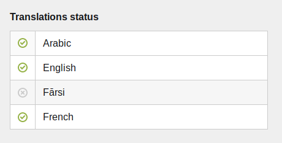

# Kirby-3 translations section

A translations section to switch beween page's languages in Kirby-3 panel.

This section adds and manages a `translated` status on its page, set to `true` or `false`.
It is usefull to keep an overview on a page's translations.



<br/>

## Installation

Download and copy this repository to `/site/plugins/translations`

Or install it with composer: `composer require samrm/translations`

<br/>

## Usage

To display the section in your page's panel, set your blueprint as follow :

```
sections:
  translations:
    headline: Translations
    type: translations
```

<br/>

## PagesMethods

This plugins goes withs the following PagesMethods :

- `$pages->translated()` to get the `translated` pages for the current language.
- `$pages->available()` to get the `translated` and `visible` pages for the current language.

<br/>

## PageMethods

This plugins goes withs the following PageMethods :

- `$page->isTranslated()` to check if the page current translation's status is `true`
- `$page->isUntranslated()` to check if the page current translation's status is not `true`
- `$page->isAvailable()` to check if the page current translation's status is `true`, and if the page is `visible`
- `$page->isUnavailable()` to check if the page current translation's status is not `true`, or if the page is not `visible`

<br/>

## Routing guards

This plugin comes with a builtin naviguation guard that protects unavailable pages translations.

To enable it, set your config as follow :

```
return [
  'samrm.translations.routing' => true
]
```
